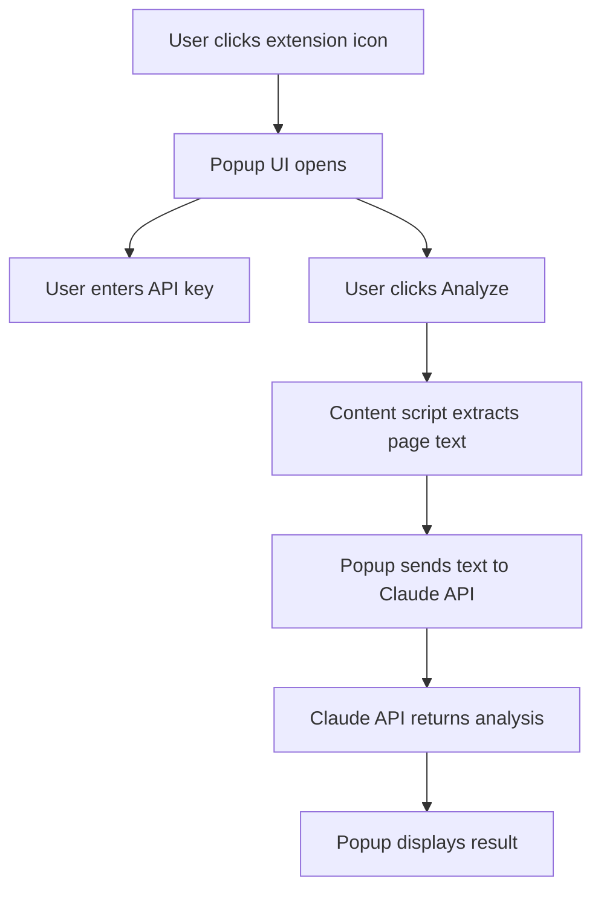

# AI Content Detector Chrome Extension

## Overview
This Chrome extension analyzes webpage content (such as emails) to detect if it is AI-generated or human-written using the Anthropic Claude API.

## Features
- Detects AI-generated content on any webpage, including Gmail.
- Uses Anthropic Claude API for analysis.
- Securely stores your API key in your browser (never in code).
- Simple popup UI for entering your API key and running analysis.

## Tech Stack
- **JavaScript** (Vanilla, ES6)
- **HTML/CSS** (Popup UI)
- **Chrome Extensions API** (Manifest V3)
- **Anthropic Claude API** (external AI service)

## How It Works
1. User installs the extension and enters their Anthropic API key in the popup.
2. When the user clicks "Analyze This Page," the extension extracts visible text from the current tab.
3. The extension sends the text to the Anthropic Claude API for analysis.
4. The result (AI-generated, Human-written, or Uncertain) is displayed in the popup.

## Security
- The API key is stored using `chrome.storage.local` and never hardcoded or committed to the repository.
- All API requests are made from the extension context.

## Setup Instructions
1. Clone or download this repository.
2. Go to `chrome://extensions/` in Chrome.
3. Enable "Developer mode".
4. Click "Load unpacked" and select the project folder.
5. Click the extension icon, enter your Anthropic API key, and start analyzing!

## Architecture Diagram

## Files
- `manifest.json` — Chrome extension manifest (V3)
- `popup.html` — Popup UI
- `popup.js` — Popup logic, API calls, storage
- `content.js` — Content script for extracting page text
- `icons.py` — (Optional) Icon generation script

